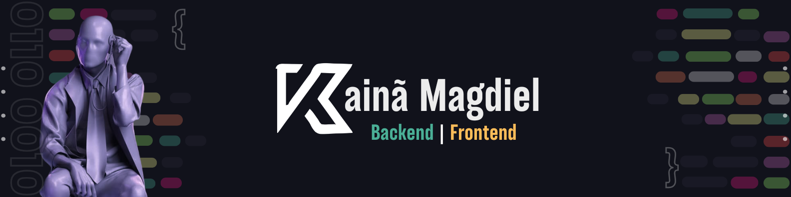
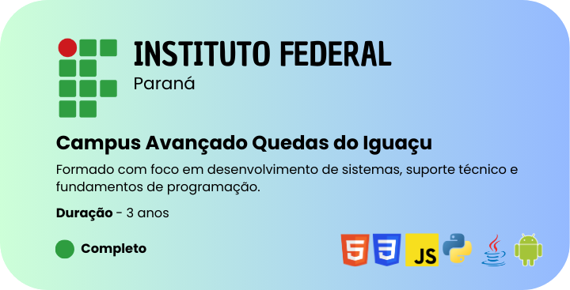
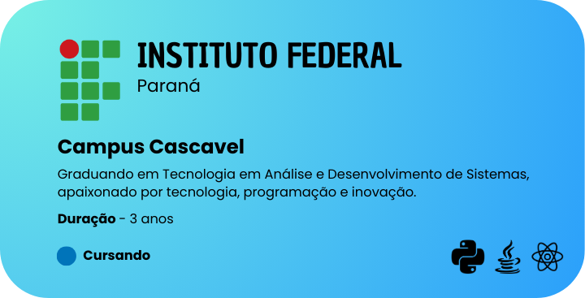

<h1 align="center">🌌 Salve, eu sou o Kainã</h1>
<h4 align="left">💻 Eu trabalho no desenvolvimento back-end e APIs quando estou focado, mas curto explorar front-end e design de interfaces nos momentos mais descontraídos. Enquanto sigo minha graduação em Tecnologia em Análise e Desenvolvimento de Sistemas, estou sempre aprimorando minhas habilidades em Node.js, frameworks como Express e bancos de dados como MongoDB e SQL. Além disso, mergulho no vasto campo de TI para ampliar meu conhecimento e me preparar para novos desafios na área de tecnologia.</h4>

 

<h3 align="left">✨ Sobre Mim </h3>
<h4 align="left">🚀 Aprimorando minhas habilidades em Node.js, TypeScript e APIs. 
💻 Experiência com Express, Flask, Django, MySQL, MongoDB e Firebase. 
📩 Pergunte-me sobre back-end, Node.js, Python ou integração de soluções de TI. 
🧠 Interesses: automação, sistemas escaláveis e novas tecnologias. 
🎯 Foco em código limpo, eficiente e soluções que fazem a diferença.</h4>
<h3> 💬 Conecte-se Comigo</h3>

  

<h3 align="center">🔆 Minha Formação</h3>

    
    

<h3 align="center">📚 Linguagens & Ferramentas</h3>
 

     
     
     
     
     

 

<!-- top repo and teck stack-->

  <h3>⭐️ Top Repositorios</h3>
  

    
    
    </a>

<h3 align="center">⚡ Github Status</h3>
 

  
  

  

> 🍃   Preocupado com uma única folha, você não verá a árvore. Preocupado com uma única árvore você não perceberá toda a floresta. Não se preocupe com um único ponto. Veja tudo em sua plenitude sem se esforçar.

 

Made with 🧙‍♂️ by <a href="https://github.com/fushisuno">Fushisuno</a>.

## 
